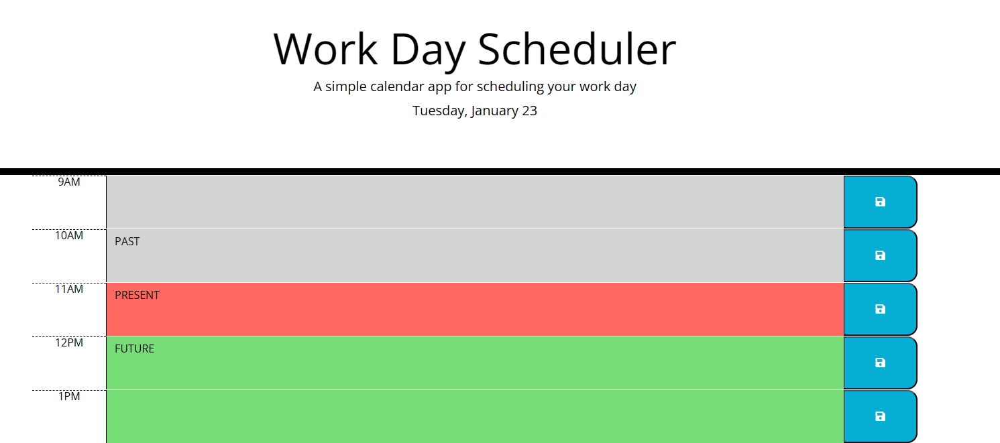

# Daily-Planner

## Description

I have created a daily planner app that displays each hour of the current day as timeblocks.

## Technologies

* JavaScript 
* HTML
* CSS
* JqueryUI
* day.js

## Installation

No steps are required for installation.

## Usage

https://theoburton.github.io/Daily-Planner

The current hour's timeblock background changes colour based on teh following:
Grey = Past
Red = Present
Green= Future

Entering text into a time-block and hittig the save button will create an event that is saved to the local storage.

## License

Please refer to the License agreement in the repository root.
